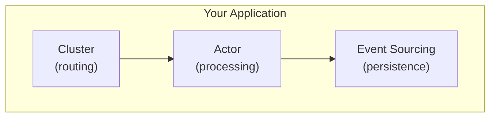

# clstr

A distributed **event sourcing framework** for Go, combining three powerful patterns into a cohesive toolkit for building scalable, event-driven systems.

## Why clstr?

Building distributed systems is hard. You need event persistence, concurrent message handling, and cluster coordination—each complex on its own, even more so together. **clstr** provides production-ready implementations of these patterns that are designed to work seamlessly as a unit.



## The Three Pillars

### [Event Sourcing](./core/es/) — Capture Every Change

Store your domain state as a sequence of immutable events rather than mutable records. This gives you:

- **Complete audit trail** — Every state change is preserved forever
- **Time travel** — Reconstruct state at any point in history
- **Event replay** — Rebuild read models or fix bugs by replaying events
- **Optimistic concurrency** — Conflict detection without locks
- **Snapshots** — Performance optimization for aggregates with many events

```go
// Define your aggregate
type Account struct {
    es.BaseAggregate
    balance int
}

func (a *Account) Deposit(amount int) {
    a.Raise(&Deposited{Amount: amount})
}

func (a *Account) Apply(event es.Event) {
    switch e := event.Data.(type) {
    case *Deposited:
        a.balance += e.Amount
    }
}

// Use it with the repository
repo := es.NewTypedRepositoryFrom[*Account](log, env.Repository())
account, _ := repo.GetByID(ctx, "acc-123")
account.Deposit(100)
repo.Save(ctx, account)
```

### [Actor Model](./core/actor/) — Scalable Concurrency

Process messages through isolated actors with mailbox-based delivery. Each actor handles one message at a time, eliminating race conditions:

- **Mailbox isolation** — No shared state, no locks, no races
- **Type-safe handlers** — Register handlers by message type with automatic JSON marshaling
- **Bounded concurrency** — Control parallelism with configurable task schedulers
- **Panic containment** — Failing handlers don't crash the system
- **Request/Response** — Built-in synchronous communication between actors

```go
// Define typed handlers
type GreetHandler struct{}

func (h *GreetHandler) Handle(ctx *actor.HandlerCtx, msg *Greet) (*Greeting, error) {
    return &Greeting{Message: "Hello, " + msg.Name}, nil
}

// Create an actor with handlers
a := actor.New(
    actor.WithHandler[*Greet, *Greeting](&GreetHandler{}),
)
a.Start(ctx)

// Send messages
response, _ := actor.Request[*Greeting](ctx, a, &Greet{Name: "World"})
```

### [Cluster](./core/cluster/) — Distributed Coordination

Route requests to the right node using consistent hashing. Scale horizontally by adding nodes:

- **Consistent hashing** — Deterministic key-to-shard mapping with minimal reshuffling
- **Smart routing** — Clients automatically route to the correct node
- **Topology awareness** — Nodes know about each other and their shard ownership
- **Transport abstraction** — Swap between in-memory (testing) and NATS (production)

```go
// Create a cluster node
node := cluster.NewNode(
    cluster.WithNodeID("node-1"),
    cluster.WithTransport(transport),
    cluster.WithHandler(actorHandler),
)
node.Start(ctx)

// Route requests by key
client := cluster.NewClient(transport, cluster.WithNumShards(256))
response, _ := client.RequestKey(ctx, "user-123", "GetProfile", payload)
```

## Better Together

The real power comes from combining all three:

| Pattern | Standalone | Combined |
|---------|------------|----------|
| **Event Sourcing** | Persistence & audit trail | Events trigger actor messages across the cluster |
| **Actor Model** | Concurrent processing | Actors are distributed across nodes via sharding |
| **Cluster** | Request routing | Routes to actors that persist via event sourcing |

**Example flow:**

1. **Client** sends `CreateOrder` to cluster, keyed by `order-123`
2. **Cluster** routes to the node owning that shard
3. **Actor** receives the message, loads the `Order` aggregate
4. **Event Sourcing** replays events to rebuild state
5. **Actor** executes business logic, raises `OrderCreated` event
6. **Event Sourcing** persists the event
7. **Consumers** react to the event (send email, update read model, etc.)

## Storage Backend

clstr uses **NATS JetStream** as its primary storage backend, providing:

- Durable event streams with configurable retention
- Key-value store for snapshots and checkpoints
- Pub/sub transport for cluster communication
- Exactly-once delivery semantics

```go
// Connect to NATS
conn := nats.MustConnect("nats://localhost:4222")

// Create the environment with NATS backend
env := es.NewEnv(
    es.WithEventStore(natses.NewEventStore(conn)),
    es.WithSnapshotter(natses.NewSnapshotter(conn)),
)
```

## Supporting Packages

- **[cache](./core/cache/)** — LRU cache with TTL support for aggregate caching
- **[perkey](./core/perkey/)** — Per-key serialization (sequential per key, parallel across keys)
- **[ds](./core/ds/)** — Generic data structures (ordered Set)
- **[metrics](./core/metrics/)** — Pluggable metrics interfaces (Counter, Gauge, Histogram, Timer)

## Observability

clstr provides optional **Prometheus metrics** for all three pillars through a pluggable interface pattern:

```go
import promadapter "github.com/codewandler/clstr-go/adapters/prometheus"

// Initialize metrics for all pillars
metrics := promadapter.NewAllMetrics(prometheus.DefaultRegisterer)

// Use with ES
env := es.NewEnv(es.WithMetrics(metrics.ES), ...)

// Use with Actor
a := actor.New(actor.Options{Metrics: metrics.Actor, ...}, handler)

// Use with Cluster
client, _ := cluster.NewClient(cluster.ClientOptions{Metrics: metrics.Cluster, ...})
```

**Available Metrics:**

| Pillar | Metrics |
|--------|---------|
| **ES** | Store/repo latencies, events appended, cache hits/misses, consumer lag, concurrency conflicts |
| **Actor** | Message duration, messages processed, panics, mailbox depth, scheduler inflight |
| **Cluster** | Request/handler duration, transport errors, shards owned |

See the [Prometheus adapter](./adapters/prometheus/) for detailed documentation.

## Quick Start

```bash
# Install
go get github.com/your-org/clstr

# Run tests
task test

# Run the cluster demo
task loadtest
```

See the [examples](./examples/) directory for complete working examples.

## Design Principles

- **Explicit over implicit** — No magic, clear data flow
- **Composition over inheritance** — Small, focused interfaces
- **Testing first** — In-memory implementations for every abstraction
- **Production ready** — Battle-tested with NATS JetStream

## License

MIT
