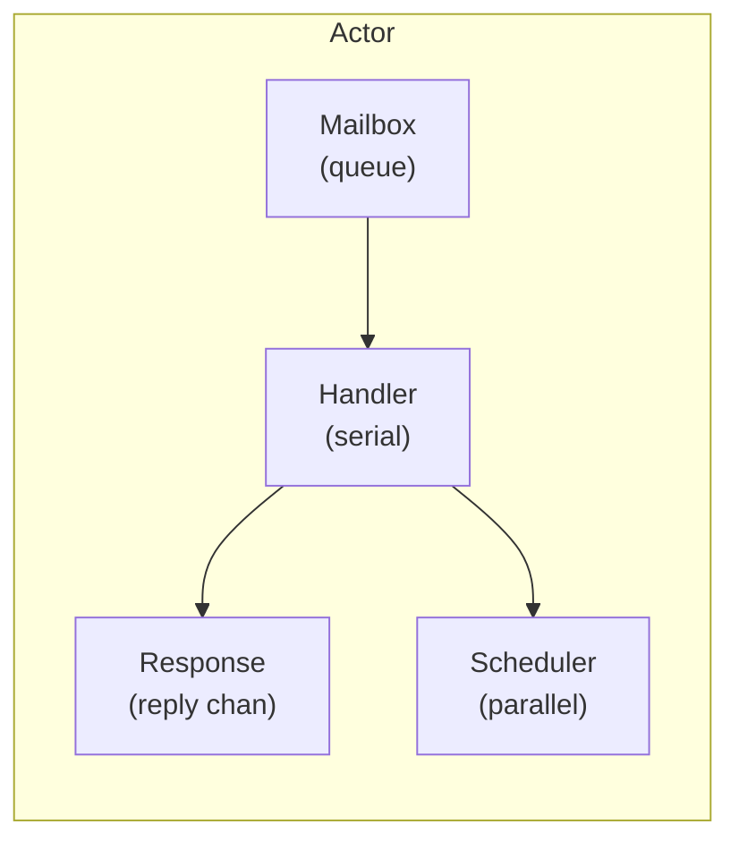

# Actor Model Package

A lightweight, type-safe actor implementation with mailbox-based message delivery, bounded concurrency, and panic containment.

## Overview

The actor package provides a mailbox-based actor model where each actor processes one message at a time, eliminating race conditions without explicit locks. Messages are enqueued and processed sequentially, ensuring thread-safe state management.



## Import

```go
import "github.com/codewandler/clstr-go/core/actor/v2"
```

## Quick Start

```go
// Define message types
type Greet struct {
    Name string
}

type Greeting struct {
    Message string
}

// Create an actor with handlers
a := actor.TypedHandlers(
    actor.HandleRequest[Greet, Greeting](func(hc actor.HandlerCtx, req Greet) (*Greeting, error) {
        return &Greeting{Message: "Hello, " + req.Name}, nil
    }),
).ToActor(actor.Options{
    Context: ctx,
})

// Send a request and wait for response
response, err := actor.Request[Greet, Greeting](ctx, a, Greet{Name: "World"})
// response.Message == "Hello, World"
```

## Core Concepts

### Actor

An actor is a concurrent unit that:
- Maintains its own isolated state
- Processes messages one at a time (no concurrent handler execution)
- Communicates only through message passing
- Contains panics without crashing the system

### Mailbox

The mailbox is a buffered channel that queues incoming messages. Messages are processed in FIFO order. The mailbox size is configurable (default: 1024).

### Handler Context

Every handler receives a `HandlerCtx` which provides:
- `context.Context` embedding (access to `Done()`, `Deadline()`, etc.)
- `Log()` — structured logger
- `Schedule(f)` — run work concurrently in the background
- `Request(ctx, msg)` — send a request to another actor (or self, with deadlock prevention)

## Handler Types

### HandleRequest — Request/Response

For handlers that return a typed response:

```go
type GetUser struct {
    ID string
}

type User struct {
    ID   string
    Name string
}

actor.HandleRequest[GetUser, User](func(hc actor.HandlerCtx, req GetUser) (*User, error) {
    // Load user from database
    return &User{ID: req.ID, Name: "Alice"}, nil
})
```

Call with:
```go
user, err := actor.Request[GetUser, User](ctx, a, GetUser{ID: "123"})
```

### HandleMsg — Fire-and-Forget

For handlers that don't need to return a value:

```go
type SendEmail struct {
    To      string
    Subject string
    Body    string
}

actor.HandleMsg[SendEmail](func(hc actor.HandlerCtx, msg SendEmail) error {
    // Send the email
    return sendEmail(msg.To, msg.Subject, msg.Body)
})
```

Call with:
```go
err := actor.Publish(ctx, a, SendEmail{
    To:      "user@example.com",
    Subject: "Welcome",
    Body:    "Hello!",
})
```

### HandleEvery — Periodic Tasks

For recurring work at fixed intervals:

```go
actor.HandleEvery(5*time.Second, func(hc actor.HandlerCtx) error {
    hc.Log().Info("heartbeat tick")
    // Perform periodic cleanup, health checks, etc.
    return nil
})
```

The timer starts when the actor is initialized and automatically stops when the actor shuts down.

### DefaultHandler — Catch-All

Handle any message type not matched by specific handlers:

```go
actor.DefaultHandler(func(hc actor.HandlerCtx, msg any) (any, error) {
    hc.Log().Warn("unhandled message", slog.Any("msg", msg))
    return nil, fmt.Errorf("unknown message type: %T", msg)
})
```

### Init — Initialization Logic

Run setup code when the actor starts:

```go
actor.Init(func(hc actor.HandlerCtx) error {
    hc.Log().Info("actor starting up")
    // Initialize resources, connections, etc.
    return nil
})
```

## Combining Handlers

Create an actor with multiple handlers using `TypedHandlers`:

```go
a := actor.TypedHandlers(
    actor.Init(func(hc actor.HandlerCtx) error {
        hc.Log().Info("initializing")
        return nil
    }),

    actor.HandleRequest[GetUser, User](handleGetUser),
    actor.HandleRequest[CreateUser, User](handleCreateUser),

    actor.HandleMsg[DeleteUser](handleDeleteUser),

    actor.HandleEvery(time.Minute, handleCleanup),

    actor.DefaultHandler(handleUnknown),
).ToActor(actor.Options{
    Context:     ctx,
    Logger:      logger,
    MailboxSize: 2048,
})
```

## Configuration Options

```go
type Options struct {
    // MailboxSize is the buffer size for the message queue (default: 1024)
    MailboxSize int

    // ControlSize is the buffer for control messages like Pause/Resume (default: 16)
    ControlSize int

    // Context for the actor's lifecycle
    Context context.Context

    // Logger for structured logging
    Logger *slog.Logger

    // OnPanic is called when a handler panics (default: logs the panic)
    OnPanic func(recovered any, stack []byte, msg any)

    // MaxConcurrentTasks caps concurrent Schedule() tasks (default: 32)
    MaxConcurrentTasks int
}
```

## Background Task Scheduling

Handlers can schedule concurrent background work using `hc.Schedule()`:

```go
actor.HandleMsg[ProcessBatch](func(hc actor.HandlerCtx, msg ProcessBatch) error {
    for _, item := range msg.Items {
        item := item // capture for goroutine
        hc.Schedule(func() {
            // Process item concurrently
            processItem(item)
        })
    }
    return nil
})
```

The scheduler:
- Limits concurrent tasks via `MaxConcurrentTasks`
- Waits for all scheduled tasks on shutdown
- Respects context cancellation

## Pause, Resume, and Step Mode

Actors support debugging and testing via control operations:

```go
// Pause processing (messages queue but aren't processed)
a.Pause()

// Resume continuous processing
a.Resume()

// Process exactly one message (useful for testing)
a.Step()
```

## Panic Containment

Handler panics are caught and logged without crashing the actor:

```go
actor.HandleMsg[DangerousWork](func(hc actor.HandlerCtx, msg DangerousWork) error {
    panic("something went wrong") // Actor keeps running
})
```

Custom panic handling:

```go
actor.Options{
    OnPanic: func(recovered any, stack []byte, msg any) {
        metrics.IncrementPanicCount()
        alerting.NotifyOnCall(recovered, stack)
    },
}
```

## Self-Request Prevention

The actor detects and prevents self-requests that would cause deadlocks:

```go
actor.HandleMsg[Trigger](func(hc actor.HandlerCtx, _ Trigger) error {
    // This would deadlock: the actor is waiting for its own response
    // while it's still processing the current message
    _, err := hc.Request(hc, AnotherMessage{})
    // err == actor.ErrSelfRequest
    return err
})
```

## Message Type Resolution

Message types are determined by:

1. **MsgType() method** — if the type implements `interface{ MsgType() string }`
2. **Reflection** — falls back to the Go type name (e.g., `"main.GetUser"`)

Custom type names:

```go
type GetUser struct {
    ID string
}

func (GetUser) MsgType() string { return "user.get" }
```

## State Management

The package includes a thread-safe state container for managing shared state:

```go
type Counter struct {
    Value int
}

state := actor.NewState(ctx, &Counter{}, func(c *Counter) {
    // Optional callback after each mutation
    fmt.Println("counter changed:", c.Value)
})

// Synchronous update
state.Process(func(c *Counter) {
    c.Value++
})

// Async update (returns channel that closes when done)
done := state.Submit(func(c *Counter) {
    c.Value += 10
})
<-done

// Read with return value
value := actor.Read(state, func(c *Counter) int {
    return c.Value
})
```

## Lifecycle

```go
// Create and start
a := actor.TypedHandlers(...).ToActor(opts)

// Actor is now running and processing messages

// Wait for shutdown (blocks until actor stops)
<-a.Done()

// Or for BaseActor, explicitly stop
if ba, ok := a.(*actor.BaseActor); ok {
    ba.Stop() // Waits for all scheduled tasks to complete
}
```

## Complete Example

```go
package main

import (
    "context"
    "fmt"
    "log/slog"
    "time"

    "github.com/codewandler/clstr-go/core/actor/v2"
)

type (
    Deposit  struct{ Amount int }
    Withdraw struct{ Amount int }
    Balance  struct{}
    BalanceResponse struct{ Amount int }
)

func main() {
    ctx, cancel := context.WithCancel(context.Background())
    defer cancel()

    balance := 0

    a := actor.TypedHandlers(
        actor.Init(func(hc actor.HandlerCtx) error {
            hc.Log().Info("account actor started")
            return nil
        }),

        actor.HandleMsg[Deposit](func(hc actor.HandlerCtx, msg Deposit) error {
            balance += msg.Amount
            hc.Log().Info("deposited", slog.Int("amount", msg.Amount), slog.Int("balance", balance))
            return nil
        }),

        actor.HandleMsg[Withdraw](func(hc actor.HandlerCtx, msg Withdraw) error {
            if msg.Amount > balance {
                return fmt.Errorf("insufficient funds")
            }
            balance -= msg.Amount
            hc.Log().Info("withdrew", slog.Int("amount", msg.Amount), slog.Int("balance", balance))
            return nil
        }),

        actor.HandleRequest[Balance, BalanceResponse](func(hc actor.HandlerCtx, _ Balance) (*BalanceResponse, error) {
            return &BalanceResponse{Amount: balance}, nil
        }),

        actor.HandleEvery(10*time.Second, func(hc actor.HandlerCtx) error {
            hc.Log().Info("periodic balance check", slog.Int("balance", balance))
            return nil
        }),
    ).ToActor(actor.Options{
        Context: ctx,
        Logger:  slog.Default(),
    })

    // Use the actor
    actor.Publish(ctx, a, Deposit{Amount: 100})
    actor.Publish(ctx, a, Withdraw{Amount: 30})

    resp, _ := actor.Request[Balance, BalanceResponse](ctx, a, Balance{})
    fmt.Printf("Current balance: %d\n", resp.Amount) // Output: Current balance: 70
}
```

## Testing

Use the test environment for deterministic testing:

```go
func TestAccountActor(t *testing.T) {
    a := actor.TypedHandlers(
        // ... handlers
    ).ToActor(actor.Options{
        Context:     t.Context(),
        MailboxSize: 100,
    })

    // Send messages
    require.NoError(t, actor.Publish(t.Context(), a, Deposit{Amount: 50}))

    // Assert responses
    resp, err := actor.Request[Balance, BalanceResponse](t.Context(), a, Balance{})
    require.NoError(t, err)
    require.Equal(t, 50, resp.Amount)
}
```

Use step mode for precise control:

```go
func TestStepMode(t *testing.T) {
    a := actor.TypedHandlers(...).ToActor(opts)

    a.(*actor.BaseActor).EnableStepMode()

    // Queue a message
    go actor.Publish(ctx, a, SomeMessage{})

    // Process exactly one message
    a.Step()

    // Assert state after single message
}
```

## Key Types Reference

| Type | Description |
|------|-------------|
| `Actor` | Interface for sending messages and controlling the actor |
| `BaseActor` | Core implementation with mailbox and control loop |
| `HandlerCtx` | Context passed to handlers with Log, Schedule, Request |
| `TypedHandlerRegistry` | Collects handlers and creates actors |
| `Scheduler` | Bounded concurrency for background tasks |
| `State[T]` | Thread-safe state container with read/write operations |
| `Options` | Configuration for actor creation |
