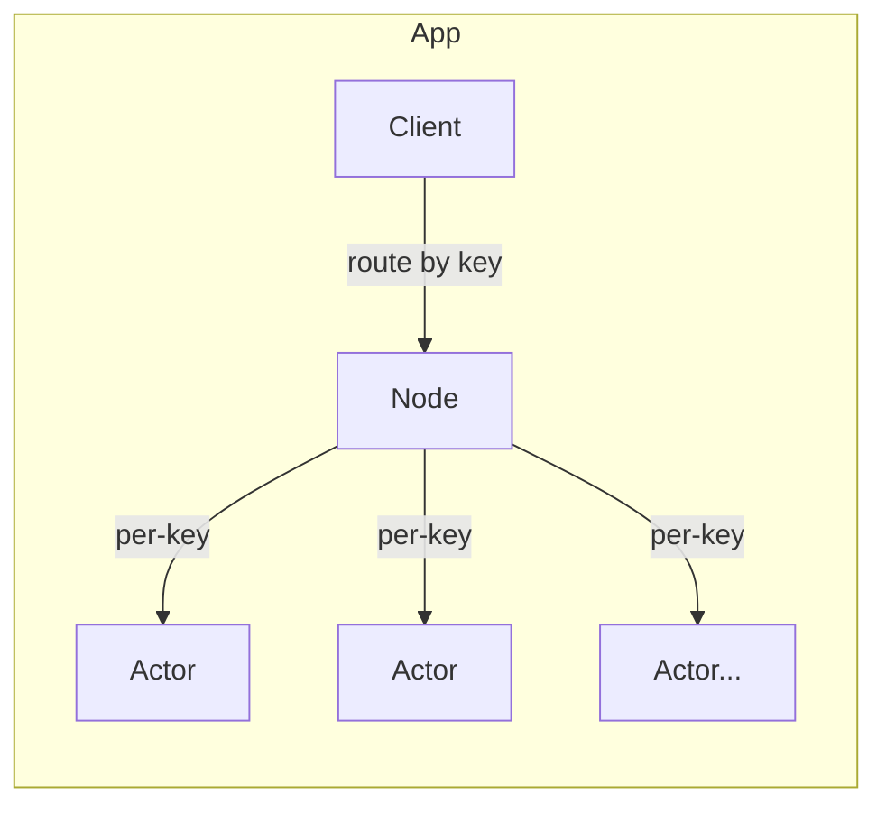

# App Package

A high-level convenience wrapper that combines Cluster + Actor into a single, easy-to-use application factory.

## Overview

The app package simplifies creating distributed actor-based applications by providing sensible defaults and reducing boilerplate. It combines a cluster Node (for shard-based routing) with per-key Actors (for message handling).



## Import

```go
import "github.com/codewandler/clstr-go/core/app"
```

## Quick Start

```go
// Define request/response types
type Ping struct{ Seq int }
type Pong struct{ Seq int }

// Create and start the app with handlers
myApp, err := app.Run(
    app.Config{},
    actor.HandleRequest[Ping, Pong](func(hc actor.HandlerCtx, req Ping) (*Pong, error) {
        return &Pong{Seq: req.Seq + 1}, nil
    }),
)
if err != nil {
    log.Fatal(err)
}

// Send requests via the client
resp, err := cluster.NewRequest[Ping, Pong](myApp.Client().Key("user-123")).
    Request(ctx, Ping{Seq: 1})
// resp.Seq == 2
```

## Configuration

### Config

```go
type Config struct {
    Context     context.Context                    // Parent context (default: context.Background())
    Log         *slog.Logger                       // Logger (default: slog.Default())
    Node        NodeConfig                         // Cluster node config
    Actor       ActorOptions                       // Actor creation options
    CreateActor func(key string) (Actor, error)   // Custom actor factory (overrides Actor options)
}
```

### NodeConfig

```go
type NodeConfig struct {
    ID        string              // Node identifier (auto-generated if empty)
    NumShards uint32              // Total shards (default: 256)
    NodeIDs   []string            // All node IDs in cluster (default: [ID])
    ShardSeed string              // Deterministic hashing seed (default: "default")
    Transport cluster.Transport   // Communication layer (default: in-memory)
    Metrics   ClusterMetrics      // Optional metrics instrumentation
}
```

### ActorOptions

```go
type ActorOptions struct {
    MailboxSize        int           // Mailbox capacity (default: 256)
    MaxConcurrentTasks int           // Cap on scheduled tasks (0 = unlimited)
    Metrics            ActorMetrics  // Optional metrics instrumentation
}
```

## App Methods

| Method | Description |
|--------|-------------|
| `Client()` | Returns the cluster client for sending requests |
| `Node()` | Returns the underlying cluster node |
| `Run()` | Starts the app (blocks until context cancelled) |
| `Stop()` | Initiates graceful shutdown (non-blocking) |
| `Shutdown(ctx)` | Stops and waits for completion or context expiry |
| `Done()` | Returns channel that closes when app is fully stopped |

## Examples

### With Metrics

```go
metrics := prometheus.NewAllMetrics(prometheus.DefaultRegisterer)

app, _ := app.Run(app.Config{
    Node: app.NodeConfig{
        Metrics: metrics.Cluster,
    },
    Actor: app.ActorOptions{
        Metrics: metrics.Actor,
    },
}, handlers...)
```

### With Custom Node ID

```go
app, _ := app.Run(app.Config{
    Node: app.NodeConfig{
        ID:        "worker-1",
        NumShards: 64,
        ShardSeed: "my-cluster",
    },
}, handlers...)
```

### Graceful Shutdown

```go
app, _ := app.Run(config, handlers...)

// Later, shutdown with timeout
ctx, cancel := context.WithTimeout(context.Background(), 5*time.Second)
defer cancel()

if err := app.Shutdown(ctx); err != nil {
    log.Printf("shutdown timed out: %v", err)
}
```

### Using New() for Deferred Start

```go
// Create without starting
app, err := app.New(config, handlers...)
if err != nil {
    return err
}

// Start in background
go func() {
    if err := app.Run(); err != nil {
        log.Printf("app error: %v", err)
    }
}()

// Wait for shutdown signal
<-ctx.Done()
app.Stop()
<-app.Done()
```

## When to Use

**Use `app.App` for:**
- Quick prototyping and testing
- Single-node deployments
- Learning the framework
- Simple applications with standard needs

**Drop down to `cluster.Node` + `cluster.Client` directly for:**
- Multi-node production deployments
- Complex per-node handler configuration
- Custom transport implementations
- Fine-grained lifecycle control

See the [counter example](../../examples/counter) for a production-style setup using the lower-level APIs directly.
