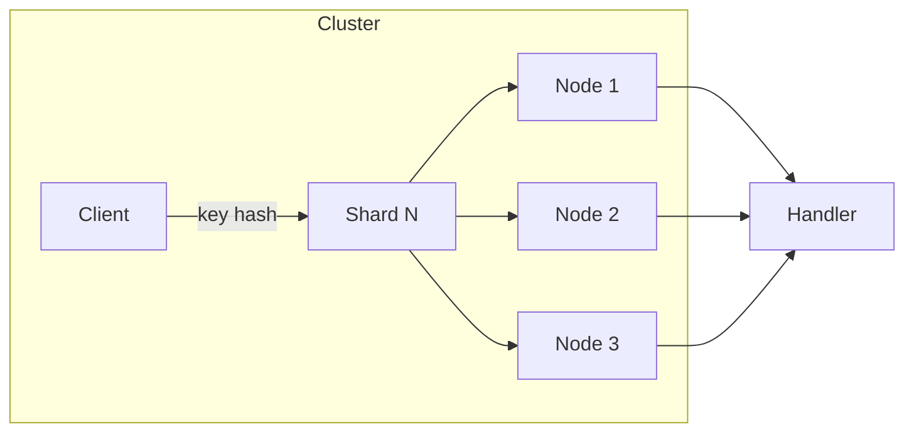

# Cluster Package

A distributed coordination layer with consistent hashing, smart routing, and pluggable transports for building horizontally scalable systems.

## Overview

The cluster package routes requests to the correct node using rendezvous hashing (HRW). Each node owns a subset of shards, and clients automatically route requests by key or shard ID. The transport abstraction allows swapping between in-memory (testing) and NATS (production).



## Import

```go
import "github.com/codewandler/clstr-go/core/cluster"
```

## Quick Start

```go
// Create transport
tr := cluster.NewInMemoryTransport()

// Create a node that owns some shards
node := cluster.NewNode(cluster.NodeOptions{
    NodeID:    "node-1",
    Transport: tr,
    Shards:    []uint32{0, 1, 2, 3},
    Handler: func(ctx context.Context, env cluster.Envelope) ([]byte, error) {
        return []byte("hello"), nil
    },
})

go node.Run(ctx)

// Create a client
client, _ := cluster.NewClient(cluster.ClientOptions{
    Transport: tr,
    NumShards: 16,
})

// Route by key (automatically maps to correct shard/node)
resp, _ := client.RequestKey(ctx, "user-123", "GetUser", payload)
```

## Core Concepts

### Envelope

The fundamental message wrapper for all cluster communication:

```go
type Envelope struct {
    Shard       int               // Target shard (0..numShards-1)
    Type        string            // Message type identifier
    Data        []byte            // Serialized payload
    Headers     map[string]string // Custom headers
    TTLMs       int64             // Time-to-live in milliseconds
    CreatedAtMs int64             // Creation timestamp
}
```

**Methods:**
- `GetHeader(key string) (string, bool)` — Retrieve header value
- `Expired() bool` — Check if TTL exceeded
- `TTL() time.Duration` — Get remaining TTL
- `Validate() error` — Validate headers (rejects reserved `x-clstr-*` prefix)

**Envelope Options:**
```go
cluster.WithHeader("trace-id", "abc123")  // Add custom header
cluster.WithTTL(5 * time.Second)          // Set request timeout
```

### Transport

Three-tier interface for flexible implementations:

```go
// Client-side: send requests
type ClientTransport interface {
    Request(ctx context.Context, env Envelope) ([]byte, error)
    Close() error
}

// Server-side: receive requests
type ServerTransport interface {
    SubscribeShard(ctx context.Context, shardID uint32, h ServerHandlerFunc) (Subscription, error)
    Close() error
}

// Bidirectional
type Transport interface {
    ClientTransport
    ServerTransport
}

type ServerHandlerFunc = func(ctx context.Context, env Envelope) ([]byte, error)
```

### Node

A cluster member that owns shards and processes messages:

```go
type NodeOptions struct {
    Log       *slog.Logger      // Optional (defaults to slog.Default())
    NodeID    string            // Optional (auto-generated if empty)
    Transport ServerTransport   // Required
    Shards    []uint32          // Required: owned shard IDs
    Handler   ServerHandlerFunc // Required
}

node := cluster.NewNode(opts)
node.Run(ctx)  // Blocks until context cancelled
```

**Auto-generated Node IDs:** Format `node-{nanoid}` (e.g., `node-Ab12Cd`)

### Client

Smart router that maps keys to shards:

```go
type ClientOptions struct {
    Transport       ClientTransport  // Required
    NumShards       uint32           // Required
    Seed            string           // Optional: for deterministic hashing
    EnvelopeOptions []EnvelopeOption // Optional: apply to all requests
}

client, _ := cluster.NewClient(opts)
```

**Routing Methods:**

```go
// Direct shard routing
client.RequestShard(ctx, shardID, "MsgType", data)
client.NotifyShard(ctx, shardID, "MsgType", data)  // Fire-and-forget

// Key-based routing (auto shard selection)
client.RequestKey(ctx, "user-123", "GetUser", data)
client.NotifyKey(ctx, "user-123", "UpdateUser", data)

// Fluent API with scoped client
resp, _ := client.Key("user-123").Request(ctx, &GetUser{ID: "123"})
resp, _ := client.Shard(5).Request(ctx, &GetUser{ID: "123"})
```

### ScopedClient

Pre-scoped client for a specific key or shard:

```go
scoped := client.Key("tenant-123")

// Strongly-typed requests
resp, err := scoped.Request(ctx, &MyRequest{})

// Fire-and-forget
err := scoped.Notify(ctx, &MyNotification{})

// Query node info
info, err := scoped.GetNodeInfo(ctx)
```

**Message Type Detection:**
1. `messageType() string` method (lowercase)
2. `MessageType() string` method
3. Reflection-based struct name (fallback)

### Typed Request Helper

Strongly-typed request/response pattern:

```go
type GetUser struct {
    ID string `json:"id"`
}

type UserResponse struct {
    ID   string `json:"id"`
    Name string `json:"name"`
}

req := cluster.NewRequest[GetUser, UserResponse](client.Key("user-123"))
user, err := req.Request(ctx, GetUser{ID: "123"})
```

## Sharding

### Consistent Hashing

Keys map to shards deterministically using BLAKE2b hashing:

```go
// Map key to shard
shard := cluster.ShardFromString("user-123", numShards, seed)
```

### Shard Distribution (Rendezvous/HRW)

Nodes claim shards using Highest Random Weight algorithm:

```go
// Calculate which shards a node owns
nodeIDs := []string{"node-1", "node-2", "node-3"}
shards := cluster.ShardsForNode("node-1", nodeIDs, 256, "seed")
```

**Properties:**
- Deterministic: all nodes agree on ownership
- Minimal reshuffling when topology changes
- No central coordinator needed

## Handler Patterns

### Per-Key Handlers

Cache handlers by key with LRU eviction:

```go
handler := cluster.NewKeyHandler(func(key string) (cluster.ServerHandlerFunc, error) {
    // Create handler for this key (e.g., load actor, aggregate)
    return func(ctx context.Context, env cluster.Envelope) ([]byte, error) {
        return []byte("tenant: " + key), nil
    }, nil
})
```

**With custom cache size:**
```go
handler := cluster.NewKeyHandlerWithOpts(createFunc, 2048)  // LRU size
```

**Default cache size:** 1024 entries

### Actor Integration

Bridge cluster messages to actor model:

```go
handler := cluster.NewActorHandler(func(key string) (actor.Actor, error) {
    return createActorForKey(key), nil
})

node := cluster.NewNode(cluster.NodeOptions{
    Transport: tr,
    Shards:    shards,
    Handler:   handler,
})
```

## In-Memory Transport

Full-featured implementation for testing:

```go
tr := cluster.NewInMemoryTransport(cluster.MemoryTransportOpts{
    MaxConcurrentHandlers: 100,        // Default: 100
    HandlerTimeout:        30*time.Second, // Default: 30s
})

// Add logging
tr = tr.WithLog(logger)
```

**Features:**
- Bounded concurrency via semaphore
- TTL enforcement with auto-expiration
- Handler timeout enforcement
- Graceful shutdown

## Testing Utilities

```go
// Create transport with cleanup
tr := cluster.CreateInMemoryTransport(t)

// Spin up multi-node cluster
cluster.CreateTestCluster(t, tr, 3, 256, "seed", handler)
// Creates nodes: node-0, node-1, node-2
// Distributes 256 shards across them
```

## Error Types

```go
cluster.ErrTransportClosed            // Transport was closed
cluster.ErrTransportNoShardSubscriber // No handler for shard
cluster.ErrEnvelopeExpired            // TTL exceeded
cluster.ErrReservedHeader             // Used x-clstr-* header
cluster.ErrHandlerTimeout             // Handler exceeded deadline
cluster.ErrKeyRequired                // Key missing for key-based routing
cluster.ErrMissingKeyHeader           // x-clstr-key header not set
```

## Built-in API

Query node information:

```go
scoped := client.Key("any-key")
info, err := scoped.GetNodeInfo(ctx)
// info.NodeID: "node-1"
// info.Shards: [0, 5, 10, ...]
```

## Complete Example

```go
package main

import (
    "context"
    "encoding/json"
    "log/slog"

    "github.com/codewandler/clstr-go/core/cluster"
)

type GetUser struct {
    ID string `json:"id"`
}

func (GetUser) messageType() string { return "GetUser" }

type UserResponse struct {
    ID   string `json:"id"`
    Name string `json:"name"`
}

func main() {
    ctx := context.Background()

    // Create transport
    tr := cluster.NewInMemoryTransport()

    // Define handler
    handler := cluster.NewKeyHandler(func(key string) (cluster.ServerHandlerFunc, error) {
        return func(ctx context.Context, env cluster.Envelope) ([]byte, error) {
            var req GetUser
            json.Unmarshal(env.Data, &req)

            resp := UserResponse{ID: req.ID, Name: "User " + req.ID}
            return json.Marshal(resp)
        }, nil
    })

    // Calculate shard distribution
    nodeIDs := []string{"node-1", "node-2"}

    // Start nodes
    for _, nodeID := range nodeIDs {
        shards := cluster.ShardsForNode(nodeID, nodeIDs, 64, "")
        node := cluster.NewNode(cluster.NodeOptions{
            NodeID:    nodeID,
            Transport: tr,
            Shards:    shards,
            Handler:   handler,
        })
        go node.Run(ctx)
    }

    // Create client
    client, _ := cluster.NewClient(cluster.ClientOptions{
        Transport: tr,
        NumShards: 64,
    })

    // Make requests
    req := cluster.NewRequest[GetUser, UserResponse](client.Key("user-123"))
    user, _ := req.Request(ctx, GetUser{ID: "123"})
    slog.Info("got user", slog.String("name", user.Name))
}
```

## Key Types Reference

| Type | Description |
|------|-------------|
| `Envelope` | Message wrapper with shard, type, data, headers, TTL |
| `Transport` | Bidirectional transport interface |
| `ClientTransport` | Client-side transport (send only) |
| `ServerTransport` | Server-side transport (receive only) |
| `Node` | Cluster member owning shards |
| `Client` | Smart router with consistent hashing |
| `ScopedClient` | Pre-scoped client for key or shard |
| `Request[IN, OUT]` | Typed request/response helper |
| `ServerHandlerFunc` | Handler callback signature |
