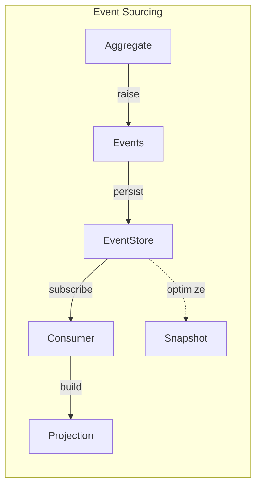

# Event Sourcing Package

A complete event sourcing framework with optimistic concurrency, snapshots, consumer checkpointing, and projection support.

## Overview

The es package stores domain state as a sequence of immutable events rather than mutable records. Aggregates raise events, the repository persists them, and consumers build projections. Snapshots optimize loading aggregates with many events.



## Import

```go
import "github.com/codewandler/clstr-go/core/es"
```

## Quick Start

```go
// Define an aggregate
type User struct {
    es.BaseAggregate
    Name  string
    Email string
}

func (u *User) GetAggType() string { return "user" }

func (u *User) Register(r es.Registrar) {
    es.RegisterEvents(r, es.Event[NameChanged](), es.Event[EmailChanged]())
}

func (u *User) Apply(evt any) error {
    switch e := evt.(type) {
    case *es.AggregateCreatedEvent:
        return u.BaseAggregate.Apply(evt)
    case *NameChanged:
        u.Name = e.Name
    case *EmailChanged:
        u.Email = e.Email
    }
    return nil
}

func (u *User) ChangeName(name string) error {
    return es.RaiseAndApply(u, &NameChanged{Name: name})
}

// Use it
env := es.NewEnv(es.WithInMemory(), es.WithAggregates(&User{}))
repo := es.NewTypedRepositoryFrom[*User](logger, env.Repository())

user, _ := repo.Create(ctx, "user-123")
user.ChangeName("Alice")
repo.Save(ctx, user)
```

## Core Concepts

### Aggregate Interface

The central domain object interface:

```go
type Aggregate interface {
    GetAggType() string      // Type name for stream identification
    GetID() string           // Unique identifier
    SetID(string)
    GetVersion() Version     // Per-aggregate version (1, 2, 3, ...)
    GetSeq() uint64          // Global stream sequence
    Create(id string) error  // Initialize new aggregate
    Register(r Registrar)    // Register event types
    Raise(event any)         // Record uncommitted event
    Apply(event any) error   // Update state from event
    Uncommitted() []any      // Get uncommitted events
    ClearUncommitted()       // Clear after save
}
```

### BaseAggregate

Embeddable base implementation:

```go
type User struct {
    es.BaseAggregate  // Embed this
    Name string
}

// BaseAggregate provides:
// - ID, Version, Seq management
// - CreatedAt timestamp
// - Uncommitted event tracking
// - Create() raises AggregateCreatedEvent
// - IsCreated() check
```

### Version Type

Per-aggregate monotonically increasing version:

```go
type Version uint64

v := es.Version(5)
v.Uint64()                    // 5
v.SlogAttr()                  // slog.Attr for logging
v.SlogAttrWithKey("ver")      // Custom key
```

### Event Helpers

```go
// Raise and apply in one call (validates, raises, applies)
es.RaiseAndApply(aggregate, &NameChanged{Name: "Alice"})

// Deferred version for method chaining
es.RaiseAndApplyD(aggregate, &NameChanged{Name: "Alice"})()

// Conditional raise
aggregate.Checked(SomeCond, func() error {
    return es.RaiseAndApply(aggregate, &SomeEvent{})
})
```

## Event Registration

### EventRegistry

Register event types for deserialization:

```go
registry := es.NewRegistry()

// Option 1: Generic helper
registry.Register(es.Event[NameChanged]())
registry.Register(es.Event[EmailChanged]())

// Option 2: Multiple at once
es.RegisterEvents(registry,
    es.Event[NameChanged](),
    es.Event[EmailChanged](),
)

// Option 3: In aggregate's Register method
func (u *User) Register(r es.Registrar) {
    es.RegisterEvents(r, es.Event[NameChanged](), es.Event[EmailChanged]())
}
```

### Envelope

Event storage container:

```go
type Envelope struct {
    ID            string          // Unique event ID
    Seq           uint64          // Global sequence (total ordering)
    Version       Version         // Per-aggregate version
    AggregateType string
    AggregateID   string
    Type          string          // Event type name
    OccurredAt    time.Time
    Data          json.RawMessage // JSON-encoded event
}
```

## EventStore Interface

Low-level event persistence:

```go
type EventStore interface {
    Stream  // Inherits Subscribe()

    Load(ctx context.Context, aggType, aggID string, opts ...StoreLoadOption) ([]Envelope, error)
    Append(ctx context.Context, aggType, aggID string, expectedVersion Version,
           events []Envelope) (*StoreAppendResult, error)
}
```

**Load Options:**
```go
es.WithStartAtVersion(es.Version(5))  // Events >= version 5
es.WithStartSeq(1000)                 // Events >= sequence 1000
```

**Concurrency Guarantee:**
- `Append()` returns `ErrConcurrencyConflict` if `expectedVersion` doesn't match
- Enables optimistic locking without explicit locks

## Repository

Application-level aggregate operations:

```go
type Repository interface {
    Load(ctx context.Context, agg Aggregate, opts ...LoadOption) error
    Save(ctx context.Context, agg Aggregate, opts ...SaveOption) error
    CreateSnapshot(ctx, agg, SnapshotSaveOpts) (Snapshot, error)
}

repo := es.NewRepository(logger, store, registry, opts...)
```

**Repository Options:**
```go
es.WithSnapshotter(snapshotter)   // Enable snapshots
es.WithRepoCache(cache)           // Add custom cache
es.WithRepoCacheLRU(1000)         // LRU cache with size
es.WithIDGenerator(gen)           // Custom event ID generation
es.WithLoadOpts(...)              // Default load options
es.WithSaveOpts(...)              // Default save options
es.WithMetrics(metrics)           // Prometheus/custom metrics
```

### TypedRepository

Generic wrapper with type safety:

```go
type TypedRepository[T Aggregate] interface {
    GetAggType() string
    New() T
    NewWithID(id string) T

    Create(ctx, aggID string, opts ...SaveOption) (T, error)
    GetOrCreate(ctx, aggID string, opts ...LoadAndSaveOption) (T, error)
    GetByID(ctx, aggID string, opts ...LoadOption) (T, error)

    WithTransaction(ctx, aggID string, fn func(T) error, opts ...WithTransactionOption) error

    Save(ctx, agg T, opts ...SaveOption) error
}

// Create from store
repo := es.NewTypedRepository[*User](logger, store, registry, opts...)

// Create from existing repository
repo := es.NewTypedRepositoryFrom[*User](logger, env.Repository(), opts...)
```

**Load/Save Options:**
```go
es.WithSnapshot(true)              // Use snapshots
es.WithUseCache(true)              // Use repository cache (default)
es.WithSnapshotTTL(time.Hour)      // Snapshot expiration (save only)
```

### Transactions

Serial per-aggregate transactions:

```go
repo.WithTransaction(ctx, "user-123", func(user *User) error {
    user.ChangeName("Bob")
    return nil  // Errors abort transaction
}, es.WithCreate(), es.WithSnapshot(true))
```

**Properties:**
- Concurrent across different aggregates
- Serial for same aggregate ID
- Prevents concurrent modifications

## Snapshots

### Snapshot Type

```go
type Snapshot struct {
    SnapshotID    string
    ObjID         string      // Aggregate or projection ID
    ObjType       string
    ObjVersion    Version     // State version at snapshot
    StreamSeq     uint64      // Global stream position
    CreatedAt     time.Time
    SchemaVersion int         // For migrations
    Encoding      string      // "json"
    Data          []byte      // Serialized state
}
```

### Snapshottable Interface

Custom serialization for aggregates:

```go
type Snapshottable interface {
    Snapshot() (data []byte, err error)
    RestoreSnapshot(data []byte) error
}

// If not implemented, JSON marshaling is used
```

### Snapshotter Interface

```go
type Snapshotter interface {
    SaveSnapshot(ctx, snapshot Snapshot, opts SnapshotSaveOpts) error
    LoadSnapshot(ctx, objType, objID string) (Snapshot, error)
}

// Implementations
es.NewInMemorySnapshotter()           // For testing
es.NewKeyValueSnapshotter(kvStore)    // With KV backend
```

### Using Snapshots

```go
// Manual snapshot on save
repo.Save(ctx, user, es.WithSnapshot(true))

// With TTL
repo.Save(ctx, user, es.WithSnapshot(true), es.WithSnapshotTTL(24*time.Hour))

// Load automatically uses snapshot if available
user, _ := repo.GetByID(ctx, "user-123", es.WithSnapshot(true))
```

## Consumers

### Consumer

Event stream processor:

```go
consumer := es.NewConsumer(store, registry, handler,
    es.WithConsumerName("user-projector"),
    es.WithMiddlewares(es.NewLogMiddleware()),
    es.WithShutdownTimeout(10*time.Second),
    es.WithLog(logger),
)

consumer.Start(ctx)  // Blocks, processing events
consumer.Stop()      // Graceful shutdown
```

### Handler Interface

```go
type Handler interface {
    Handle(msgCtx MsgCtx) error
}

// Convenience function
handler := es.Handle(func(m es.MsgCtx) error {
    switch e := m.Event().(type) {
    case *NameChanged:
        // Update projection
    }
    return nil
})
```

### MsgCtx

Event processing context:

```go
type MsgCtx interface {
    Context() context.Context
    Log() *slog.Logger
    Event() any              // Decoded event
    Live() bool              // True after catch-up complete
    Seq() uint64             // Global sequence
    Version() Version        // Aggregate version
    AggregateID() string
    AggregateType() string
    OccurredAt() time.Time
    Envelope() Envelope      // Raw envelope
    Data() json.RawMessage   // Raw JSON
}
```

**Live Mode:**
- `Live() == false` during replay/catch-up
- `Live() == true` for real-time events
- Useful for skipping side effects during replay

### Middleware

```go
// Built-in logging middleware
es.NewLogMiddleware(slog.String("component", "consumer"))

// Custom middleware
func MyMiddleware(next es.Handler) es.Handler {
    return es.Handle(func(m es.MsgCtx) error {
        // Before
        err := next.Handle(m)
        // After
        return err
    })
}
```

## Checkpointing

Track last processed event for exactly-once semantics:

```go
type CpStore interface {
    Get(ctx context.Context) (uint64, error)
    Set(ctx context.Context, seq uint64) error
}

// Implementations
cpStore := es.NewInMemCpStore()

// Use with middleware
consumer := es.NewConsumer(store, registry, handler,
    es.WithMiddlewares(es.NewCheckpointMiddleware(cpStore)),
)
```

**Per-Aggregate Checkpointing:**
```go
type AggCpStore interface {
    Get(ctx, projectionName, aggKey string) (Version, error)
    Set(ctx, projectionName, aggKey string, Version) error
}

aggCpStore := es.NewInMemAggCpStore()
```

## Subscriptions

Subscribe to event streams:

```go
type Stream interface {
    Subscribe(ctx context.Context, opts ...SubscribeOption) (Subscription, error)
}

type Subscription interface {
    Cancel()
    MaxSequence() uint64
    Chan() <-chan Envelope
}
```

**Subscribe Options:**
```go
es.WithDeliverPolicy(es.DeliverAllPolicy)  // Replay all events
es.WithDeliverPolicy(es.DeliverNewPolicy)  // Only new events
es.WithStartSequence(1000)                 // Resume from sequence
es.WithFilters(es.SubscribeFilter{
    AggregateType: "user",
    AggregateID:   "user-123",
})
```

## Projections

### Projection Interface

```go
type Projection interface {
    Name() string
    Handler  // Inherits Handle(msgCtx) error
}
```

### SnapshotProjection

Automatic snapshotting for projections:

```go
type UserIndex struct {
    ByID   map[string]*User
    ByName map[string]*User
}

func (p *UserIndex) Name() string { return "user-index" }

func (p *UserIndex) Handle(m es.MsgCtx) error {
    // Update index
    return nil
}

func (p *UserIndex) Snapshot() ([]byte, error) {
    return json.Marshal(p)
}

func (p *UserIndex) RestoreSnapshot(data []byte) error {
    return json.Unmarshal(data, p)
}

// Wrap with automatic snapshotting
proj, _ := es.NewSnapshotProjection(logger, &UserIndex{}, snapshotter,
    es.WithSnapshotFrequency(100),  // Snapshot every 100 events in live mode
)

consumer := env.NewConsumer(proj)
```

## Environment

Factory for coordinated components:

```go
env := es.NewEnv(
    es.WithStore(store),              // Custom store
    es.WithSnapshotter(snapshotter),  // Custom snapshotter
    es.WithInMemory(),                // Shorthand: in-memory everything
    es.WithLog(logger),
    es.WithCtx(ctx),
    es.WithEvent[NameChanged](),      // Register event types
    es.WithAggregates(&User{}),       // Register aggregates
    es.WithConsumer(handler, opts),   // Pre-configure consumer
    es.WithProjection(projection),    // Pre-configure projection
)

env.Start()  // Starts all consumers
defer env.Shutdown()

// Access components
repo := env.Repository()
store := env.Store()
consumer := env.NewConsumer(handler)
```

## Metrics

The ES package supports pluggable metrics via the `ESMetrics` interface:

```go
import promadapter "github.com/codewandler/clstr-go/adapters/prometheus"

// Create Prometheus metrics
metrics := promadapter.NewESMetrics(prometheus.DefaultRegisterer)

// Use with environment
env := es.NewEnv(
    es.WithMetrics(metrics),
    // ... other options
)

// Or with repository directly
repo := es.NewRepository(log, store, registry, es.WithMetrics(metrics))

// Or with consumer
consumer := es.NewConsumer(store, registry, handler, es.WithMetrics(metrics))
```

**Available Metrics:**

| Metric | Type | Labels | Description |
|--------|------|--------|-------------|
| `clstr_es_store_load_duration_seconds` | Histogram | `aggregate_type` | Event store load latency |
| `clstr_es_store_append_duration_seconds` | Histogram | `aggregate_type` | Event store append latency |
| `clstr_es_events_appended_total` | Counter | `aggregate_type` | Events appended count |
| `clstr_es_repo_load_duration_seconds` | Histogram | `aggregate_type` | Repository load latency |
| `clstr_es_repo_save_duration_seconds` | Histogram | `aggregate_type` | Repository save latency |
| `clstr_es_concurrency_conflicts_total` | Counter | `aggregate_type` | Optimistic lock failures |
| `clstr_es_cache_hits_total` | Counter | `aggregate_type` | Cache hits |
| `clstr_es_cache_misses_total` | Counter | `aggregate_type` | Cache misses |
| `clstr_es_snapshot_load_duration_seconds` | Histogram | `aggregate_type` | Snapshot load latency |
| `clstr_es_snapshot_save_duration_seconds` | Histogram | `aggregate_type` | Snapshot save latency |
| `clstr_es_consumer_event_duration_seconds` | Histogram | `event_type`, `live` | Event processing time |
| `clstr_es_consumer_events_total` | Counter | `event_type`, `live`, `success` | Events processed |
| `clstr_es_consumer_lag` | Gauge | `consumer` | Consumer lag (sequences behind) |

If no metrics are provided, a no-op implementation is used (zero overhead).

## Error Types

```go
es.ErrAggregateNotFound       // Aggregate doesn't exist
es.ErrConcurrencyConflict     // Version mismatch on save
es.ErrUnknownEventType        // Event type not registered
es.ErrStoreNoEvents           // No events to store
es.ErrSnapshotterUnconfigured // Snapshotter not set
es.ErrSnapshotNotFound        // No snapshot exists
es.ErrCheckpointNotFound      // No checkpoint exists
```

## In-Memory Store

Full-featured implementation for testing:

```go
store := es.NewInMemoryStore()
```

**Features:**
- Thread-safe with mutex protection
- Optimistic concurrency checking
- Subscription support with live mode detection
- Filtering by aggregate type/ID

## Complete Example

```go
package main

import (
    "context"
    "log/slog"

    "github.com/codewandler/clstr-go/core/es"
)

// Events
type NameChanged struct{ Name string }
type EmailChanged struct{ Email string }

// Aggregate
type User struct {
    es.BaseAggregate
    Name  string
    Email string
}

func (u *User) GetAggType() string { return "user" }

func (u *User) Register(r es.Registrar) {
    es.RegisterEvents(r, es.Event[NameChanged](), es.Event[EmailChanged]())
}

func (u *User) Apply(evt any) error {
    switch e := evt.(type) {
    case *es.AggregateCreatedEvent:
        return u.BaseAggregate.Apply(evt)
    case *NameChanged:
        u.Name = e.Name
    case *EmailChanged:
        u.Email = e.Email
    }
    return nil
}

func (u *User) ChangeName(name string) error {
    return es.RaiseAndApply(u, &NameChanged{Name: name})
}

func (u *User) ChangeEmail(email string) error {
    return es.RaiseAndApply(u, &EmailChanged{Email: email})
}

// Projection
type UserProjection struct {
    Users map[string]string // id -> name
}

func (p *UserProjection) Handle(m es.MsgCtx) error {
    switch e := m.Event().(type) {
    case *NameChanged:
        p.Users[m.AggregateID()] = e.Name
    }
    return nil
}

func main() {
    ctx := context.Background()
    logger := slog.Default()

    // Create environment
    env := es.NewEnv(
        es.WithInMemory(),
        es.WithLog(logger),
        es.WithAggregates(&User{}),
    )
    env.Start()
    defer env.Shutdown()

    // Create typed repository
    repo := es.NewTypedRepositoryFrom[*User](logger, env.Repository())

    // Create and modify aggregate
    user, _ := repo.Create(ctx, "user-123")
    user.ChangeName("Alice")
    user.ChangeEmail("alice@example.com")
    repo.Save(ctx, user, es.WithSnapshot(true))

    // Load aggregate
    loaded, _ := repo.GetByID(ctx, "user-123")
    slog.Info("loaded user", slog.String("name", loaded.Name))

    // Transactional update
    repo.WithTransaction(ctx, "user-123", func(u *User) error {
        return u.ChangeName("Bob")
    })

    // Create projection consumer
    proj := &UserProjection{Users: make(map[string]string)}
    consumer := env.NewConsumer(es.Handle(proj.Handle))
    go consumer.Start(ctx)

    // Query projection
    // proj.Users["user-123"] == "Bob"
}
```

## Testing

```go
func TestUser(t *testing.T) {
    env := es.NewEnv(es.WithInMemory(), es.WithAggregates(&User{}))
    env.Start()
    defer env.Shutdown()

    repo := es.NewTypedRepositoryFrom[*User](slog.Default(), env.Repository())

    user, err := repo.Create(t.Context(), "test-user")
    require.NoError(t, err)

    require.NoError(t, user.ChangeName("Test"))
    require.NoError(t, repo.Save(t.Context(), user))

    loaded, err := repo.GetByID(t.Context(), "test-user")
    require.NoError(t, err)
    require.Equal(t, "Test", loaded.Name)
}
```

## Key Types Reference

| Type | Description |
|------|-------------|
| `Aggregate` | Domain object interface |
| `BaseAggregate` | Embeddable base implementation |
| `Version` | Per-aggregate version number |
| `Envelope` | Event storage container |
| `EventStore` | Low-level event persistence |
| `Repository` | Application-level aggregate operations |
| `TypedRepository[T]` | Generic type-safe repository |
| `Consumer` | Event stream processor |
| `MsgCtx` | Event processing context |
| `Handler` | Event handler interface |
| `Snapshot` | Serialized aggregate state |
| `Snapshotter` | Snapshot persistence |
| `Projection` | Read model builder |
| `Env` | Component factory |
